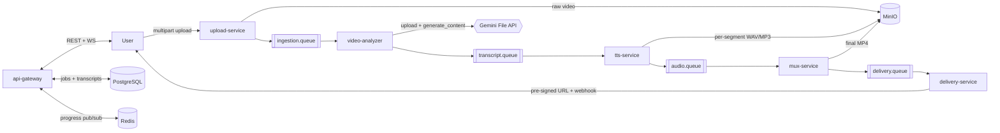
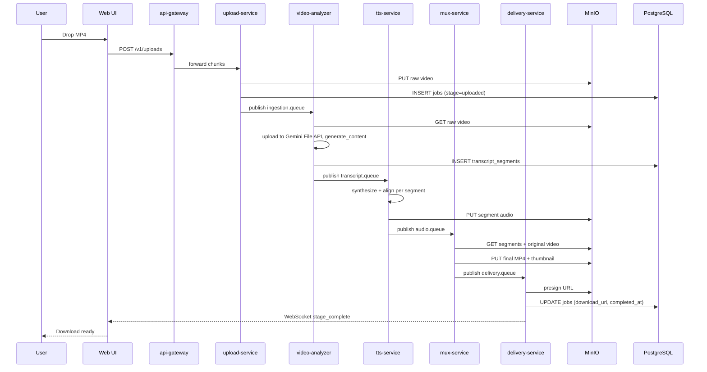

# Architecture

Recast AI is a queue-driven pipeline that turns a raw screen recording into a narrated MP4. The system is composed of a Go API gateway, a Go upload worker, two Python AI workers, two Go post-processing workers, and a Next.js 16 web app. Every stage is stateless, communicates via RabbitMQ, and persists intermediate artifacts to MinIO (S3-compatible) and PostgreSQL.

The goals of this layout are (1) horizontal scalability per stage, (2) fault isolation via queues and DLQs, and (3) clean idempotency per job-attempt.

## Pipeline Flow

## Services

### api-gateway

- **Directory:** `cmd/api-gateway`, `internal/gateway`
- **Responsibilities:** JWT auth, request validation, job CRUD, transcript CRUD, share-token mint, WebSocket fan-out for job progress, rate limiting.
- **Key files:** `cmd/api-gateway/main.go`, handlers under `internal/gateway/handlers`, middleware under `internal/gateway/middleware`.
- **Env vars:** `DATABASE_URL`, `REDIS_URL`, `RABBITMQ_URL`, `JWT_SECRET`, `S3_ENDPOINT`, `S3_BUCKET`, `S3_ACCESS_KEY`, `S3_SECRET_KEY`, `CORS_ORIGIN`.
- **Health port:** `8080` (`/healthz`, `/readyz`, `/metrics`).

### upload-service

- **Directory:** `cmd/upload-service`
- **Responsibilities:** chunked multipart upload, MIME sniffing, duration probe, write raw video to MinIO, publish the initial `ingestion.queue` message.
- **Env vars:** `DATABASE_URL`, `RABBITMQ_URL`, `S3_ENDPOINT`, `S3_BUCKET`, `S3_ACCESS_KEY`, `S3_SECRET_KEY`, `MAX_UPLOAD_BYTES`.
- **Health port:** `8081` (`/healthz`, `/metrics`).

### video-analyzer

- **Directory:** `services/video-analyzer`
- **Responsibilities:** consumes `ingestion.queue`, downloads the raw video from MinIO, uploads it to the Gemini File API, polls until `ACTIVE`, invokes `generate_content` with a schema-constrained response, writes segments to PostgreSQL, deletes the remote file, and publishes `transcript.queue`.
- **Key files:** `services/video-analyzer/main.py`, `services/video-analyzer/gemini_client.py`, `services/video-analyzer/schema.py`.
- **Env vars:** `GEMINI_API_KEY`, `GEMINI_MODEL` (default `gemini-2.5-pro`), `RABBITMQ_URL`, `DATABASE_URL`, `S3_ENDPOINT`, `S3_BUCKET`, `S3_ACCESS_KEY`, `S3_SECRET_KEY`.
- **Health port:** `8082` (`/healthz`, `/metrics`).

### tts-service

- **Directory:** `services/tts-service`
- **Responsibilities:** consumes `transcript.queue`, synthesizes each segment with the configured provider (ElevenLabs, Polly, or gTTS), extracts word-level timings from the provider response, applies FFmpeg `atempo` so audio fits the scene boundary, writes segment audio to MinIO, and publishes `audio.queue`.
- **Key files:** `services/tts-service/main.py`, `services/tts-service/providers/`, `services/tts-service/alignment.py`.
- **Env vars:** `ELEVENLABS_API_KEY` (optional), `AWS_ACCESS_KEY_ID`, `AWS_SECRET_ACCESS_KEY`, `AWS_REGION` (optional, for Polly), `RABBITMQ_URL`, `DATABASE_URL`, `S3_ENDPOINT`, `S3_BUCKET`.
- **Health port:** `8083` (`/healthz`, `/metrics`).

### mux-service

- **Directory:** `cmd/mux-service`, `internal/muxer`
- **Responsibilities:** consumes `audio.queue`, concatenates per-segment audio files on the correct timeline offsets, muxes the composite audio against the original video via FFmpeg, writes the final MP4 to MinIO, generates a thumbnail, and publishes `delivery.queue`.
- **Env vars:** `RABBITMQ_URL`, `DATABASE_URL`, `S3_ENDPOINT`, `S3_BUCKET`, `S3_ACCESS_KEY`, `S3_SECRET_KEY`, `FFMPEG_BIN` (default `ffmpeg`).
- **Health port:** `8084` (`/healthz`, `/metrics`).

### delivery-service

- **Directory:** `cmd/delivery-service`, `internal/delivery`
- **Responsibilities:** consumes `delivery.queue`, generates a pre-signed URL for the final MP4, persists `download_url` on the job row, pushes the `stage_complete` event to Redis for WebSocket fan-out, delivers any registered webhooks (up to 3 attempts with exponential backoff).
- **Env vars:** `RABBITMQ_URL`, `DATABASE_URL`, `REDIS_URL`, `S3_ENDPOINT`, `S3_BUCKET`, `DOWNLOAD_URL_TTL_SECONDS` (default `3600`).
- **Health port:** `8085` (`/healthz`, `/metrics`).

## Data Model

### `users`

| Column | Type | Purpose |
|---|---|---|
| `id` | `UUID` | Primary key. |
| `email` | `VARCHAR(255)` | Unique login identity. |
| `password_hash` | `VARCHAR(255)` | Argon2id hash, nullable for OAuth-only accounts. |
| `name` | `VARCHAR(255)` | Display name. |
| `role` | `VARCHAR(20)` | `user` or `admin`. |
| `oauth_provider`, `oauth_id` | `VARCHAR` | Populated when authenticated via Google or GitHub. |
| `avatar_url` | `TEXT` | Profile picture URL. |
| `created_at`, `updated_at` | `TIMESTAMPTZ` | Audit timestamps. |

### `jobs`

| Column | Type | Purpose |
|---|---|---|
| `id` | `UUID` | Primary key. |
| `user_id` | `UUID` | Owner. |
| `stage` | `VARCHAR(30)` | Current pipeline stage (`uploaded`, `analyzing`, `synthesizing`, `muxing`, `delivered`, `failed`). |
| `original_file` | `TEXT` | MinIO key for the raw upload. |
| `original_name` | `VARCHAR(512)` | Filename the user uploaded. |
| `duration_ms` | `BIGINT` | Probed video duration. |
| `voice_id` | `VARCHAR(100)` | FK-like reference to `voices.id`. |
| `style` | `VARCHAR(20)` | `formal` or `casual`. |
| `language` | `VARCHAR(10)` | BCP-47 tag. |
| `priority` | `INT` | Scheduling hint. |
| `audio_path`, `output_file` | `TEXT` | MinIO keys for muxed audio and final MP4. |
| `thumbnail_path` | `TEXT` | MinIO key for the generated thumbnail. |
| `share_token` | `VARCHAR(64)` | Opaque public share token, unique when non-null. |
| `download_url` | `TEXT` | Pre-signed URL for the final MP4. |
| `error_message` | `TEXT` | Populated when `stage = failed`. |
| `trace_id` | `VARCHAR(64)` | Stable correlation ID for tracing. |
| `created_at`, `updated_at`, `completed_at` | `TIMESTAMPTZ` | Audit timestamps. |

### `transcript_segments`

| Column | Type | Purpose |
|---|---|---|
| `id` | `UUID` | Primary key. |
| `job_id` | `UUID` | Parent job. |
| `segment_idx` | `INT` | Ordinal within the job, unique per job. |
| `start_ms`, `end_ms` | `BIGINT` | Scene boundaries on the original timeline. |
| `text` | `TEXT` | Narration copy. |
| `words_json` | `JSONB` | Word-level timings produced by the TTS layer. |
| `confidence` | `DOUBLE PRECISION` | Gemini-reported confidence. |
| `audio_path` | `TEXT` | MinIO key for the rendered segment audio. |
| `approved`, `flagged` | `BOOLEAN` | Human-review state. |

### `voices`

| Column | Type | Purpose |
|---|---|---|
| `id` | `VARCHAR(100)` | Stable identifier (for example `nova`, `atlas`). |
| `name` | `VARCHAR(255)` | Display name. |
| `gender` | `VARCHAR(20)` | `male`, `female`, or `neutral`. |
| `accent` | `VARCHAR(50)` | Regional accent label. |
| `provider` | `VARCHAR(50)` | `elevenlabs`, `polly`, or `gtts`. |
| `sample_url` | `TEXT` | Preview audio URL. |

### `webhooks`

| Column | Type | Purpose |
|---|---|---|
| `id` | `UUID` | Primary key. |
| `user_id` | `UUID` | Owner. |
| `url` | `TEXT` | Destination. |
| `secret` | `VARCHAR(255)` | HMAC signing secret. |
| `active` | `BOOLEAN` | Soft disable flag. |
| `created_at` | `TIMESTAMPTZ` | Audit. |

The `webhooks` table is retained for delivery callbacks; management endpoints are out of scope for the April 2026 refactor.

### `refresh_tokens`

| Column | Type | Purpose |
|---|---|---|
| `id` | `UUID` | Primary key. |
| `user_id` | `UUID` | Owner. |
| `token_hash` | `VARCHAR(255)` | SHA-256 of the refresh token, unique. |
| `expires_at` | `TIMESTAMPTZ` | Absolute expiry. |
| `created_at` | `TIMESTAMPTZ` | Audit. |

## Happy-Path Sequence

## Error Handling and Retries

- Every queue has a dedicated dead-letter queue: `ingestion.queue.dlq`, `transcript.queue.dlq`, `audio.queue.dlq`, `delivery.queue.dlq`. A consumer that exceeds the retry budget publishes to the DLQ with the original headers and a structured failure record.
- The delivery-service attempts webhook dispatch up to three times with exponential backoff (2s, 8s, 32s) before giving up.
- Every queue message carries a `stage_attempt_id` (UUID). Consumers check Redis for an existing entry and acknowledge-drop duplicates, ensuring idempotency across redelivery.
- Schema-validation failures on Gemini responses trigger exactly one strict-reminder retry before routing to the DLQ.

## Observability

- **Tracing.** Every job receives a `trace_id` when the upload is accepted. All services propagate it through queue headers and log lines. OTLP spans flow through the `otel-collector` container and are exported to any OTLP-compatible backend (Tempo, Jaeger, Honeycomb).
- **Metrics.** Each service exposes Prometheus metrics on its `/metrics` endpoint. The compose stack ships a Prometheus scraper configuration that targets the service discovery aliases.
- **Logs.** Go services use `slog` JSON output; Python services use `structlog` with a JSON renderer. All logs stream to stdout where they are captured by the container runtime.
